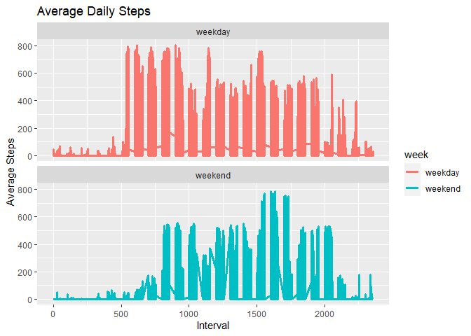

## Loading and preprocessing the data

```r
library(knitr)
library(lubridate)
library(ggplot2)
library(dplyr)
activity_data <- read.csv("activity.csv")
activity_data <- transform(activity_data, date = factor(date))
```


## What is mean total number of steps taken per day?

```r
total_steps <- activity_data %>% filter(!is.na(steps)) %>% group_by(date) %>%
  summarize(steps = sum(steps))
hist_plot <- ggplot(total_steps, aes(x = steps)) +
  geom_histogram(binwidth = 700, fill = "steelblue") +
  labs(title = "Total Number of Steps Per Day", x = "Total Steps", y = "Count")
hist_plot
```

<!-- -->


```r
ggsave("./figure/plot1.png", hist_plot)
```


```r
mean_steps <- mean(total_steps$steps)
```


```r
median_steps <- median(total_steps$steps)
```

The mean total number of steps is 10766.19.  
The median total number of steps is 10765.


## What is the average daily activity pattern?

```r
interval_steps <- activity_data %>% filter(!is.na(steps)) %>% group_by(interval) %>%
  summarize(steps = mean(steps))
time_plot <- ggplot(interval_steps, aes(x = interval, y = steps, group = 1)) +
  geom_line(color = "indianred3", size = 1.1) +
  labs(title = "Average Daily Steps", x = "Interval", y = "Average Steps")
time_plot
```

<!-- -->


```r
ggsave("./figure/plot2.png", time_plot)
```


```r
max_steps <- interval_steps[interval_steps$steps == max(interval_steps$steps), ]
```

The **835** 5-minute interval has the maximum number of steps.

## Imputing missing values

```r
total_na <- sum(is.na(activity_data$steps))
```

There are 2304 missing values.  
The mean of the total number of steps by the 5-minute interval can be used
to replace those missing values.  


```r
new_activity <- activity_data %>% group_by(interval) %>%
    summarize(steps = mean(steps, na.rm = TRUE))
new_total_steps <- activity_data %>% replace(is.na(.), floor(new_activity$steps)) %>%
    group_by(date) %>% summarize(steps = sum(steps))
new_hist_plot <- ggplot(new_total_steps, aes(x = steps)) +
  geom_histogram(binwidth = 700, fill = "steelblue") +
  labs(title = "Total Number of Steps Per Day", x = "Total Steps", y = "Count")
new_hist_plot
```

<!-- -->


```r
ggsave("./figure/plot3.png", new_hist_plot)
```


```r
new_mean_steps <- mean(new_total_steps$steps)
new_median_steps <- median(new_total_steps$steps)

matrix_dt <- matrix(NA, nrow = 2, ncol = 3)
matrix_dt[, 1] <- c("NA Ignored", "NA Replaced")
matrix_dt[, 2:3] <- c(mean_steps, new_mean_steps, median_steps, new_median_steps)
colnames(matrix_dt) <- list("Estimate", "Mean", "Median")
kable(matrix_dt)
```


|Estimate    |Mean             |Median |
|:-----------|:----------------|:------|
|NA Ignored  |10766.1886792453 |10765  |
|NA Replaced |10749.7704918033 |10641  |
The values differ by a small margin. 


## Are there differences in activity patterns between weekdays and weekends?
